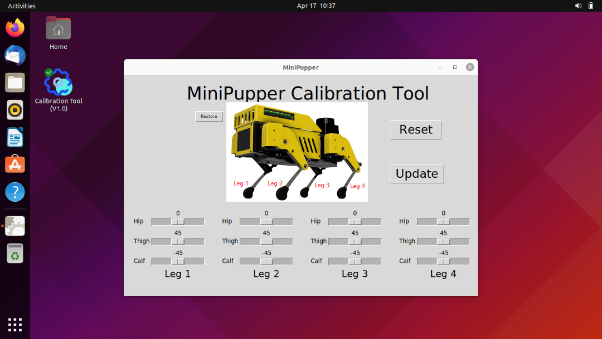

# Mini Pupper ROS2
 
## 1. Setup
### 1.1 PC Setup
**Ubuntu 22.04 + ROS2 Humble is required.** 
 
Create ROS2 workspace
```sh
cd ~
mkdir colcon_ws
cd colcon_ws
mksir src
```
 
Clone [mini_pupper_ros](https://github.com/mangdangroboticsclub/mini_pupper_ros/tree/ros2), [champ](https://github.com/chvmp/champ/tree/ros2) and [ldlidar_stl_ros2](https://github.com/ldrobotSensorTeam/ldlidar_stl_ros2).
```sh
cd ~/colcon_ws/src
# ROS applications for Mini Pupper
git clone https://github.com/mangdangroboticsclub/mini_pupper_ros.git -b ros2
# Quadruped robot controller
git clone --recursive https://github.com/chvmp/champ.git -b ros2
# LiDAR driver
git clone https://github.com/ldrobotSensorTeam/ldlidar_stl_ros2.git
```
 
Install dependencies, and then compile ROS packages with colcon.
```sh
cd ~/colcon_ws
# Install dependencies
rosdep install --from-paths src --ignore-src -r -y
sudo apt-get install ros-humble-ros2-controllers ros-humble-cartographer-ros ros-humble-depthai-ros # TODO: add to rosdep install
# Currently for compiling setup.py in ROS Humble
pip install setuptools==58.2.0
# Compile all packages.
colcon build
```
 
Automatically setup for terminal.
```sh
echo "source ~/colcon_ws/install/setup.bash" >> ~/.bashrc
echo "export ROS_DOMAIN_ID=42" >> ~/.bashrc
```
 
### 1.2 Mini Pupper Setup
**Ubuntu 22.04 + ROS2 Humble is required.** 
 
Install BSP(Board Support Package) for MiniPupper: [mini_pupper_bsp](https://github.com/mangdangroboticsclub/mini_pupper_bsp)
```sh
cd ~
mkdir QuadrupedRobot
cd QuadrupedRobot
# BSP(Board Support Package) for MiniPupper
git clone https://github.com/mangdangroboticsclub/mini_pupper_bsp.git
cd mini_pupper_bsp
./install.sh	
sudo reboot
```
 
Calibrate with a GUI tool.
```sh
calibrate
```
Make sure your Mini Pupper standing like this:

Then update the configuration.

 

Create ROS2 workspace
```sh
cd ~
mkdir colcon_ws
cd colcon_ws
mksir src
```

Clone [mini_pupper_ros](https://github.com/mangdangroboticsclub/mini_pupper_ros/tree/ros2), [champ](https://github.com/chvmp/champ/tree/ros2) and [ldlidar_stl_ros2](https://github.com/ldrobotSensorTeam/ldlidar_stl_ros2).
```sh
cd ~/colcon_ws/src
# ROS applications for Mini Pupper
git clone https://github.com/mangdangroboticsclub/mini_pupper_ros.git -b ros2
# Quadruped robot controller
git clone --recursive https://github.com/chvmp/champ.git -b ros2
# LiDAR driver
git clone https://github.com/ldrobotSensorTeam/ldlidar_stl_ros2.git
```

Install dependencies, and then compile ROS packages with colcon.
```sh
cd ~/colcon_ws
# Install dependencies
rosdep install --from-paths src --ignore-src -r -y
sudo apt-get install ros-humble-ros2-controllers ros-humble-cartographer-ros ros-humble-depthai-ros # TODO: add to rosdep install
# Currently for compiling setup.py in ROS Humble
pip install setuptools==58.2.0
# Compile all packages except for Gazebo.
# On Raspberry Pi, you don't need to use Gazebo.
colcon build --packages-ignore champ_gazebo mini_pupper_gazebo
```

OAK Camera configuration
```sh
# Setup udev rules
echo 'SUBSYSTEM=="usb", ATTRS{idVendor}=="03e7", MODE="0666"' | sudo tee /etc/udev/rules.d/80-movidius.rules
sudo udevadm control --reload-rules && sudo udevadm trigger
```

LiDAR configuration
```sh
# Make sure you have connected LiDAR to Raspberry Pi
# Suppose your LiDAR port name is /dev/ttyUSB0
sudo chmod 777 /dev/ttyUSB0
```

Automatically setup for terminal.
```sh
echo "source ~/colcon_ws/install/setup.bash" >> ~/.bashrc
echo "export ROS_DOMAIN_ID=42" >> ~/.bashrc
```

## 2. Some examples
### 2.1 Basic motion
```sh
# Terminal 1
# Execute on Mini Pupper
ros2 launch mini_pupper_bringup hardware_bringup.launch.py

# Execute on PC
ros2 launch mini_pupper_bringup bringup.launch.py

# Execute on PC
ros2 run teleop_twist_keyboard teleop_twist_keyboard
# Then control robot dog with your keyboard
```

### 2.2 Basic motion in Gazebo
```sh
# Execute on PC
ros2 launch mini_pupper_gazebo gazebo.launch.py

# Execute on PC
rviz2 -d src/champ/champ_description/rviz/urdf_viewer.rviz

# Execute on PC
ros2 run teleop_twist_keyboard teleop_twist_keyboard
# Then control robot dog with your keyboard
```

### 2.3 Cartographer
```sh
# Execute on Mini Pupper
ros2 launch mini_pupper_bringup hardware_bringup.launch.py

# Execute on PC
ros2 launch mini_pupper_bringup bringup.launch.py

# Execute on PC
ros2 launch mini_pupper_navigation slam.launch.py
# if you have a pre-built map, try this command instead:
# ros2 launch mini_pupper_navigation pure_localization.launch.py

# Execute on PC
ros2 launch mini_pupper_navigation nav2.launch.py
```

If you want to save the map:
```sh
ros2 service call /finish_trajectory cartographer_ros_msgs/srv/FinishTrajectory "{trajectory_id: 0}"
ros2 service call /write_state cartographer_ros_msgs/srv/WriteState "{filename: '${HOME}/mymap.pbstream'}"
ros2 run nav2_map_server map_saver_cli -f ${HOME}/mymap
```

### 2.4 Cartographer in Gazebo
```sh
# Execute on PC
ros2 launch mini_pupper_gazebo gazebo.launch.py

# Execute on PC
ros2 launch mini_pupper_navigation slam.launch.py use_sim_time:=true
# if you have a pre-built map, try this command instead:
# ros2 launch mini_pupper_navigation pure_localization.launch.py use_sim_time:=true

# Execute on PC
ros2 run teleop_twist_keyboard teleop_twist_keyboard
# Then control robot dog with your keyboard
```

If you want to save the map:
```sh
ros2 service call /finish_trajectory cartographer_ros_msgs/srv/FinishTrajectory "{trajectory_id: 0}"
ros2 service call /write_state cartographer_ros_msgs/srv/WriteState "{filename: '${HOME}/mymap.pbstream'}"
ros2 run nav2_map_server map_saver_cli -f ${HOME}/mymap
```

### 2.5 OAK camera demo
```sh
# Execute on Mini Pupper
ros2 launch mini_pupper_bringup bringup.launch.py hardware_connected:=true

# Execute on Mini Pupper
ros2 launch mini_pupper_oak mini_pupper_oak.launch.py
```