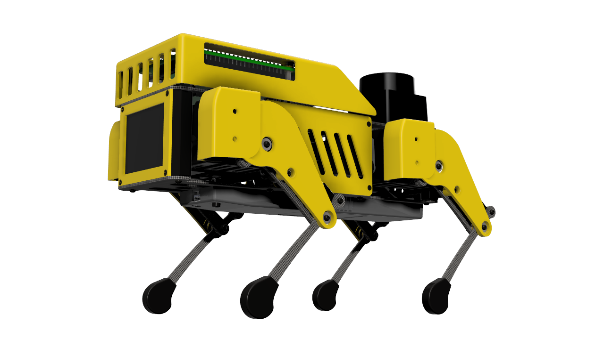
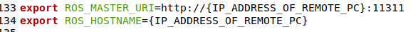
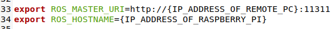
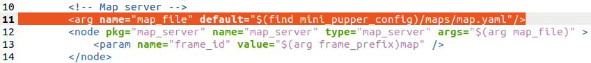
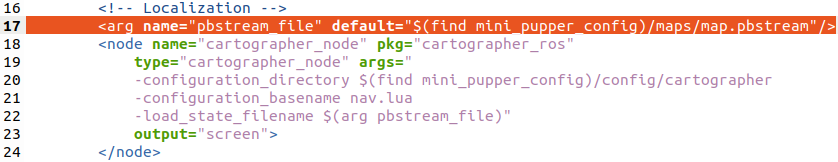

# Mini Pupper ROS Packages

ROS packages for Mini Pupper.



Mini Pupper is an open source dog-shaped 12-DOF quadruped robot,supporting ROS (Robot Operating System). With ROS, you can explore the SLAM and Navigation functions with Mini Pupper. The controller of Mini Pupper's ROS packages is based on [champ](https://github.com/chvmp/champ) project, and we made some changes to the SLAM and Navigation functions.

Tested on
* Ubuntu 20.04 (ROS Noetic)
* Ubuntu 18.04 (ROS Melodic).

## 1.Installation Guide
We recommend you explore Mini Pupper with ROS network, make sure your PC and Mini Pupper have connected to the same WiFi.

### 1.1 PC Setup
**The PC Setup corresponds to the Remote PC (your desktop or laptop PC) which will control Mini Pupper. Do not apply this instruction to your Mini Pupper.**

#### 1.1.1 Cartographer ROS packages installation
Our SLAM and Navigation functions are based on [cartographer_ros](https://google-cartographer-ros.readthedocs.io/en/latest/compilation.html). 
```sh
cd ~
sudo apt-get update
sudo apt-get install -y python3-wstool python3-rosdep ninja-build stow
mkdir carto_ws
cd carto_ws
wstool init src
wstool merge -t src https://raw.githubusercontent.com/cartographer-project/cartographer_ros/master/cartographer_ros.rosinstall
wstool update -t src
sudo rosdep init
rosdep update
rosdep install --from-paths src --ignore-src --rosdistro=${ROS_DISTRO} -y
src/cartographer/scripts/install_abseil.sh
sudo apt-get remove ros-${ROS_DISTRO}-abseil-cpp
catkin_make_isolated --install --use-ninja
source install_isolated/setup.bash
```
#### 1.1.2 Mini Pupper ROS packages installation

```sh
cd <your_ws>/src
git clone --recursive https://github.com/mangdangroboticsclub/minipupper_ros
cd ..
rosdep install --from-paths src --ignore-src -r -y
catkin_make
source <your_ws>/devel/setup.bash
```

#### 1.1.3 Network Setup
Connect your PC and Mini Pupper to the same WiFi and find the assigned IP address with the command below.
```sh
ifconfig
```
Open the file and update the ROS IP settings with the command below.
```sh
sudo gedit ~/.bashrc
```
Then add your Master and hostname config.



For example
```sh
export ROS_MASTER_URI=http://192.168.1.106:11311
export ROS_HOSTNAME=192.168.1.106
```


### 1.2 Mini Pupper Setup
**The Mini Pupper Setup corresponds to the Raspberry Pi on your Mini Pupper.**

#### 1.2.1 Hardware Dependencies
You should first install the dependencies of the servos, battery moniter and display screen. See [minipupper_ros_bsp](https://github.com/mangdangroboticsclub/minipupper_ros_bsp).
#### 1.2.2 PS4 Joystick interface installation
The PS4 Joystick interface in ROS is based on [ps4-ros](https://github.com/solbach/ps4-ros) project. 
```sh
pip install ds4drv
sudo apt install ros-noetic-joy
sudo wget https://raw.githubusercontent.com/chrippa/ds4drv/master/udev/50-ds4drv.rules -O /etc/udev/rules.d/50-ds4drv.rules
sudo udevadm control --reload-rules
sudo udevadm trigger
sudo reboot
```
Then go into pairing mode with PS4: Playstation button + share button for ~5 sec.
Run $ds4drv from command line until PS4 Joystick is connected.
```sh
ds4drv
```
This will output something like "Created devices /dev/input/jsX".
Then give the permissions to the device
```sh
sudo chmod a+rw /dev/input/jsX
```

#### 1.2.3 Mini Pupper ROS packages installation
**Then you can install the ROS packages for Mini Pupper. This should be installed both on Mini Pupper and your PC.**

```sh
cd <your_ws>/src
git clone --recursive https://github.com/mangdangroboticsclub/minipupper_ros
cd ..
rosdep install --from-paths src --ignore-src -r -y
catkin_make
source <your_ws>/devel/setup.bash
```

#### 1.2.4 Network Setup
Connect your PC and Mini Pupper to the same WiFi and find the assigned IP address with the command below.
```sh
ifconfig
```
Open the file and update the ROS IP settings with the command below.
```sh
sudo gedit ~/.bashrc
```
Then add your Master and hostname config.



For example
```sh
export ROS_MASTER_URI=http://192.168.1.106:11311
export ROS_HOSTNAME=192.168.1.107
```

## 2.Quick Start Guide
### 2.1 Calibration
You should first calibrate the angles of every servo. Just input the angles.
```sh
roslaunch servo_interface calibrate.launch
```
The hip and shank should be horizontal, and the ham should be vertical.
### 2.2 Walking
#### 2.2.1 Run the base driver
**You should run this command on Mini Pupper**
```sh
roslaunch mini_pupper bringup.launch
```

#### 2.2.2 Control Mini Pupper
There are two options to control Mini Pupper:

1.using keyboard

**It's recommended to run this command on PC.**
```sh
roslaunch champ_teleop teleop.launch
```

2.using PS4 joystick

**It's recommended to run this command on Mini Pupper.**

**Don't run this command while using move_base because when you are doing nothing with the joystick, it would set all the values in cmd_vel to zero.**
```sh
roslaunch ps4_interface ps4_interface.launch
```
Then you can go into pairing mode with PS4: Playstation button + share button for ~5 sec.
* The left lever controls the linear velocity of x and y axis.
* The right lever controls the angular velocity of z axis.
* The arrow key controls the standing height and the angle of roll axis.
* If you are pressing R2, then the right lever will control the angle of pitch and yaw axis.
* If you are pressing L2, then the robot will go to the default state. 


### 2.3 SLAM
#### 2.3.1 Run the base driver
**You should run this command on Mini Pupper**
```sh
roslaunch mini_pupper bringup.launch
```

#### 2.3.2 Run Cartographer
**You should run this command on PC**
```sh
roslaunch mini_pupper slam.launch
```
Then you can use keyboard or joystick to control your Mini Pupper walking around and creating a map. To save the map, run these commands below.
```sh
rosservice call /finish_trajectory 0
rosservice call /write_state "{filename: '${HOME}/map.pbstream'}"
rosrun cartographer_ros cartographer_pbstream_to_ros_map -map_filestem=${HOME}/map -pbstream_filename=${HOME}/map.pbstream -resolution=0.05
```


### 2.4 Navigation
#### 2.4.1 Change the map file
Before running navigation, you should first change the launch file with the map you created. 
```sh
roscd mini_pupper/launch
sudo gedit navigate.launch
```
Then change arg of the map_file and pbstream_file.


#### 2.4.2 Run the base driver
**You should run this command on Mini Pupper**
```sh
roslaunch mini_pupper bringup.launch
```

#### 2.4.3 Run Cartographer(for localization) and Move_Base
**You should run this command on PC**


```sh
roslaunch mini_pupper navigate.launch
```


## 3.Going further

We've tested the integration with OAK-D-LITE. It's a great platform to run some deep learning models. If you want to use this platform, you can follow the official instructions to build the ROS dependencies and run the examples.

Also, if you want to do some CV projects, you can add a usb camera on Mini Pupper, and subscribe the comressed image on your PC. But the transportation of raw image through network will be too slow, you may need to use image_transport to turn the compressed image to normal image and then use it.

```sh
rosrun image_transport republish compressed in:=(in_base_topic) raw out:=(out_base_topic)
```
<<<<<<< HEAD

=======
>>>>>>> 14c7d0298a3e300e632e0b2687f501f21ab14ed7
