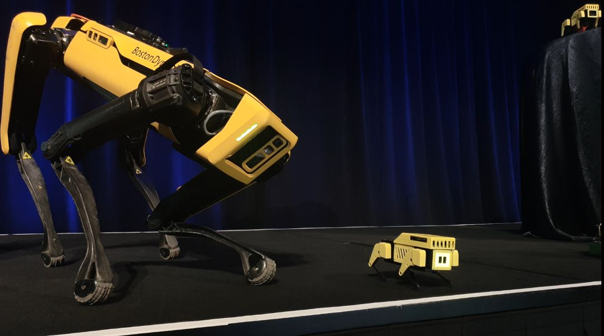
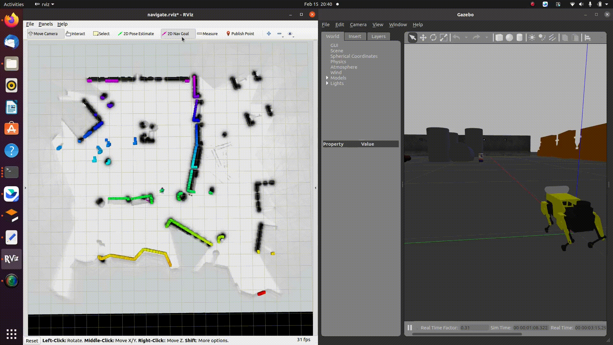

# Mini Pupper ROS Repository



Mini Pupper workshop at Amazon reMARS2022 event, JUNE 21 – 24, 2022 | LAS VEGAS, NV


Mini Pupper Navigation Demo with Lidar

Mini Pupper is an open source 12-DOF quadruped robot,supporting ROS (Robot Operating System). With ROS, you can explore SLAM and Navigation functions with Mini Pupper. The controller of Mini Pupper's ROS packages is based on [champ](https://github.com/chvmp/champ) project, and we made some changes to SLAM and Navigation functions.

Tested on
* Ubuntu 20.04 (ROS Noetic)

## 1.Installation Guide

We recommend you explore Mini Pupper with ROS network, make sure your PC and Mini Pupper have connected to the same WiFi.

### 1.1 PC Setup

**PC Setup corresponds to PC (your desktop or laptop PC) for controlling Mini Pupper remotely. Do not apply these commands to your Mini Pupper.**

#### 1.1.1 Cartographer ROS packages installation

Our SLAM and Navigation functions are based on [cartographer_ros](https://google-cartographer-ros.readthedocs.io/en/latest/compilation.html).

First, install ROS Noetic Desktop-Full by following the page below.

https://wiki.ros.org/noetic/Installation/Ubuntu

Next, install cartographer_ros.

```sh
sudo apt-get update
sudo apt-get install -y python3-vcstool python3-rosdep ninja-build stow
mkdir -p ~/carto_ws/src
cd ~/carto_ws
vcs import src --input https://raw.githubusercontent.com/cartographer-project/cartographer_ros/master/cartographer_ros.rosinstall
# Hot fix for Ubuntu 20.04. See https://github.com/cartographer-project/cartographer_ros/pull/1745
sed -i -e "s%<depend>libabsl-dev</depend>%<\!--<depend>libabsl-dev</depend>-->%g" src/cartographer/package.xml
sudo rosdep init
rosdep update
source /opt/ros/noetic/setup.bash
rosdep install --from-paths src --ignore-src -r -y
src/cartographer/scripts/install_abseil.sh
sudo apt-get remove ros-${ROS_DISTRO}-abseil-cpp
catkin_make_isolated --install --use-ninja
source install_isolated/setup.bash
```

#### 1.1.2 Mini Pupper ROS packages installation

This should be done in a workspace *outside* of the `carto_ws` workspace, like `catkin_ws`.  
Download the Mini Pupper ROS package in the workspace.

```sh
cd $YOUR_WS/src
git clone -b ros1 https://github.com/mangdangroboticsclub/minipupper_ros.git
```

Download Champ repo, you can also refer to the [champ](https://github.com/chvmp/champ) README.
**Then you can install the ROS packages for Mini Pupper.**

```sh
cd $YOUR_WS/src
vcs import < minipupper_ros/.minipupper.repos --recursive
```

Build and install all ROS packages.

```sh
rosdep install --from-paths . --ignore-src -r -y
catkin_make
source $YOUR_WS/devel/setup.bash
```

#### 1.1.3 Network Setup

Connect your PC and Mini Pupper to the same WiFi and find the assigned IP address with the command below.

```sh
ifconfig
```
Open the file and update ROS IP settings with commands below.

```sh
gedit ~/.bashrc
```
Then add your ROS_MASTER_URI and ip address config.


For example:

```sh
export ROS_MASTER_URI=http://192.168.1.106:11311
export ROS_IP=192.168.1.106
```


### 1.2 Mini Pupper Setup
**Mini Pupper Setup corresponds to the Raspberry Pi on your Mini Pupper.**

#### 1.2.1 Hardware Dependencies and ROS

You should first install dependencies of servos, battery moniter and display screen.  
See [minipupper-bsp](https://github.com/mangdangroboticsclub/minipupper-bsp).

Install ROS Noetic ROS-Base (No GUI) by following the page below.

https://wiki.ros.org/noetic/Installation/Ubuntu

#### 1.2.2 Controller Joystick interface installation

PS4 Joystick interface in ROS is based on [Controller-ROS](https://github.com/solbach/ps4-ros) project.

```sh
sudo -H python3 -m pip install ds4drv
sudo apt install ros-noetic-joy
sudo wget https://raw.githubusercontent.com/chrippa/ds4drv/master/udev/50-ds4drv.rules -O /etc/udev/rules.d/50-ds4drv.rules
sudo udevadm control --reload-rules
sudo udevadm trigger
sudo reboot
```

Then go into pairing mode with PS4: Playstation button + share button for ~5 sec.
Run $ds4drv from command line until PS4 Joystick is connected.

```sh
ds4drv
```

This will output something like "Created devices /dev/input/jsX".
Then give the permissions to the device

```sh
sudo chmod a+rw /dev/input/jsX
```

#### 1.2.3 Mini Pupper ROS packages installation

Install the build tools first.

```sh
sudo apt install -y python3-vcstool python3-rosdep
```

Download the Mini Pupper ROS package in the workspace, `catkin_ws`.

```sh
cd ~/catkin_ws/src
git clone -b ros1 https://github.com/mangdangroboticsclub/minipupper_ros.git
```

Download Champ repo, you can also refer to the [champ](https://github.com/chvmp/champ) README.
**Then you can install the ROS packages for Mini Pupper.**

```sh
cd ~/catkin_ws/src
vcs import < minipupper_ros/.minipupper.repos --recursive

# it's not recommend to compile gazebo and cartographer on raspberry pi
touch champ/champ/champ_description/CATKIN_IGNORE
touch champ/champ/champ_gazebo/CATKIN_IGNORE
touch champ/champ/champ_navigation/CATKIN_IGNORE
touch minipupper_ros/mini_pupper_gazebo/CATKIN_IGNORE
touch minipupper_ros/mini_pupper_navigation/CATKIN_IGNORE
```

Build and install all ROS packages.

```sh
# install dependencies without unused heavy packages
rosdep install --from-paths . --ignore-src -r -y --skip-keys=joint_state_publisher_gui --skip-keys=octomap_server
cd ~/catkin_ws
catkin_make
source ~/catkin_ws/devel/setup.bash
```

#### 1.2.4 Network Setup

Connect your PC and Mini Pupper to the same WiFi and find the assigned IP address with commands below.

```sh
ifconfig
```

Open the file and update the ROS IP settings with the command below.

```sh
nano ~/.bashrc
```
Then add your ROS_MASTER_URI and ip address config.


For example:

```sh
export ROS_MASTER_URI=http://192.168.1.106:11311
export ROS_IP=192.168.1.107
```

After editing, input Ctrl+X to save and exit the nano editor.

## 2.Quick Start Guide
### 2.1 Calibration

Calibrate the servo angle offset according to the following document.

https://minipupperdocs.readthedocs.io/en/latest/guide/Software.html

### 2.2 Walking
#### 2.2.1 Run the base driver

**You should run this command on Mini Pupper**

```sh
roslaunch mini_pupper_bringup bringup.launch
```

If you don't have LD06 LiDAR, add `lidar_connected:=false` argument like the follwoing command.

```sh
roslaunch mini_pupper_bringup bringup.launch lidar_connected:=false
```

#### 2.2.2 Control Mini Pupper

There are two options to control Mini Pupper:

1.Using keyboard


**It's recommended to run this command on PC.**

```sh
roslaunch champ_teleop teleop.launch
```

2.Using PS4 joystick

**It's recommended to run this command on Mini Pupper.**

**Don't run this command while using move_base because even if you are doing nothing with the joystick, it would still send cmd_vel with all the values as zero.**

```sh
roslaunch mini_pupper_teleop ps4_interface.launch
```

Then you can go into pairing mode with PS4: Playstation button + share button for ~5 sec.
* The left lever controls the linear velocity of x and y axis.
* The right lever controls the angular velocity of z axis.
* The arrow key controls the standing height and the angle of roll axis.
* If you are pressing R2, then the right lever will control the angle of pitch and yaw axis.
* If you are pressing L2, then the robot will turn to default state.


### 2.3 SLAM
#### 2.3.1 Run the base driver
**You should run this command on Mini Pupper**

```sh
roslaunch mini_pupper_bringup bringup.launch
```

#### 2.3.2 Run Cartographer

**You should run this command on PC**  
**Notice: If you are using gazebo, set the param /use_sim_time in navigate.launch as true.**

```sh
roslaunch mini_pupper_navigation slam.launch
```

Then you can use keyboard or joystick to control your Mini Pupper walking around and creating a map. To save the map, run these commands below.

```sh
rosservice call /finish_trajectory 0
rosservice call /write_state "{filename: '${HOME}/map.pbstream'}"
rosrun cartographer_ros cartographer_pbstream_to_ros_map -map_filestem=${HOME}/map -pbstream_filename=${HOME}/map.pbstream -resolution=0.05
```

Remember to edit map.yaml  
The first line should be

```yaml
image: map.pgm
```

Then, copy map.pbstream, map.pgm and map.yaml files you just saved to $YOUR_WS/src/minipupper_ros/mini_pupper/maps

### 2.4 Navigation
#### 2.4.1 Change the map file
Before running navigation, you should first change the launch file with the map you created. 
```sh
roscd mini_pupper_navigation/launch
sudo gedit navigate.launch
```
Then change arg of the map_file and pbstream_file.


#### 2.4.2 Run the base driver

**You should run this command on Mini Pupper**

```sh
roslaunch mini_pupper_bringup bringup.launch
```

#### 2.4.3 Run Cartographer(for localization) and move_base

**You should run this command on PC**  
**Notice: If you are using gazebo, set the param /use_sim_time in navigate.launch as true.**

```sh
roslaunch mini_pupper_navigation navigate.launch
```

## 3.Simulation

You can also play with Mini Pupper with only your laptop.  



See the [README in mini_pupper_gazebo](./mini_pupper_gazebo/README.md).

## 4.Computer Vision

Mini Pupper OpenCV Object Detection Demo
### Installation of OAK Camera SDK
```sh
sudo apt-get install ros-noetic-depthai-ros
```
### Try Object Following demo
```sh
# Terminal 1
roslaunch mini_pupper_bringup bringup.launch

# Terminal 2
roslaunch mini_pupper_examples follow_object.launch
```


See the [README in mini_pupper_examples](./mini_pupper_examples/README.md).

## Notices

This project includes open source software. See [NOTICES.md](./NOTICES.md) for details.
