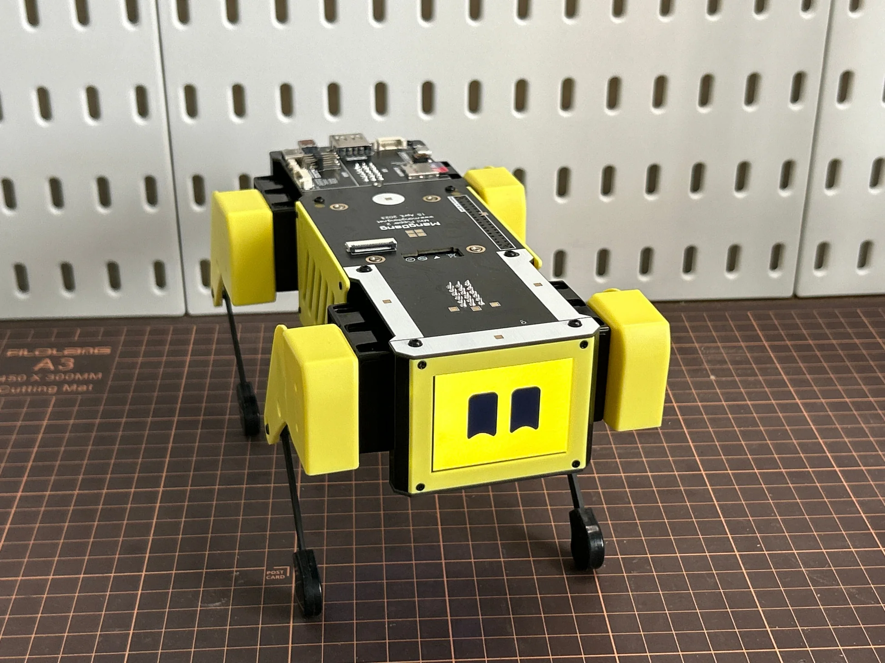
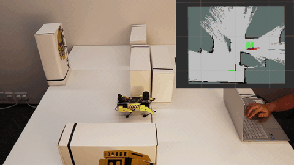

[](http://docs.ros.org/en/jazzy/index.html)
&nbsp;
[](https://ubuntu.com/)
&nbsp;
[](https://github.com/mangdangroboticsclub/mini_pupper_ros/blob/ros2/LICENSE)
&nbsp;
[](https://github.com/mangdangroboticsclub/mini_pupper_ros/actions/workflows/industrial_ci.yml)
&nbsp;
[](https://minipupperdocs.readthedocs.io/en/latest/)
&nbsp;
[](https://twitter.com/LeggedRobot)

# Mini Pupper ROS 2 Jazzy

<p align="left">
  
</p>

A comprehensive ROS 2 robotics platform for autonomous navigation, computer vision, and multi-robot coordination. Built for research, education, and development on Ubuntu 24.04 with ROS 2 Jazzy.

## Key Capabilities

<p align="left">
  
</p>

### SLAM & Autonomous Navigation
Real-time mapping and path planning with ROS 2 Nav2 stack integration.  
**[Documentation](mini_pupper_navigation/README.md)**

### Computer Vision Tracking
YOLO11-powered person detection and following with multi-object tracking.  
**[Documentation](mini_pupper_tracking/README.md)**

### Multi-Robot Fleet Management
Centralized command and control for coordinated multi-robot operations.  
**[Documentation](mini_pupper_fleet/README.md)**

### Choreographed Movement System
Programmable dance sequences with audio synchronization capabilities.  
**[Documentation](mini_pupper_dance/README.md)**

## Quick Start

### Pre-built Images
Flash the ready-to-use image containing Ubuntu 24.04, ROS 2 Jazzy, and all Mini Pupper packages:
- **Mini Pupper 2**: [Ubuntu24.04.ROS2Jazzy.MiniPupper2](https://drive.google.com/drive/folders/1_HNbIb2RDmHpwECjqiVlkylvU19BSfOh?usp=sharing)
- **Mini Pupper**: [Ubuntu24.04.ROS2Jazzy.MiniPupper](https://drive.google.com/drive/folders/1jJm_6qBIYGGp2dpZNm668D0eH1JpfCqn?usp=sharing)

### Test Basic Movement
```bash
# Terminal 1 (SSH to robot)
source ~/ros2_ws/install/setup.bash
ros2 launch mini_pupper_bringup bringup.launch.py
```
```bash

# Terminal 2 (PC or robot)
source ~/ros2_ws/install/setup.bash
ros2 run teleop_twist_keyboard teleop_twist_keyboard
```

**Note**: Refer to the [Detailed Setup Guide](docs/detailed-setup-guide.md) for network configuration, PC setup, troubleshooting, and full BSP manual installation as an alternative to the pre-built image.

For comprehensive documentation, visit our [online guide](https://minipupperdocs.readthedocs.io/en/latest/).

## Contributing
Contributions are welcome.
Whether it’s reporting a bug, suggesting a new feature, or submitting a pull request, we’d love your help in improving the **Mini Pupper ROS 2 project**.  

- Read our [CONTRIBUTING.md](CONTRIBUTING.md) guide to get started.  
- Explore or work on [open issues](https://github.com/mangdangroboticsclub/mini_pupper_ros/issues).  

## License

```
Copyright 2022-2024 MangDang

Licensed under the Apache License, Version 2.0 (the "License");
you may not use this file except in compliance with the License.
You may obtain a copy of the License at

    http://www.apache.org/licenses/LICENSE-2.0

Unless required by applicable law or agreed to in writing, software
distributed under the License is distributed on an "AS IS" BASIS,
WITHOUT WARRANTIES OR CONDITIONS OF ANY KIND, either express or implied.
See the License for the specific language governing permissions and
limitations under the License.
```