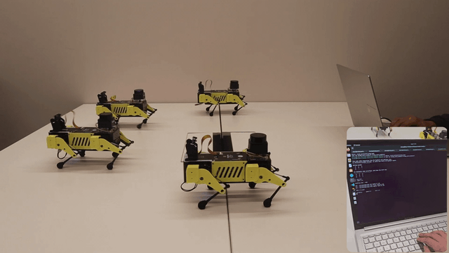

# Mini Pupper Fleet Control System

This ROS 2 package enables multi-robot operation for a group of Mini Pupper 2 robots, with centralized command distribution and individual robot pose estimation.

The system combines fleet-level command coordination, IMU-based Extended Kalman Filter (EKF) pose estimation with attitude correction, and individual robot behaviour control to enable scalable multi-robot deployments.

<p align="left">
  
</p>

## Features

- **Centralized Fleet Control** with `/cmd_vel` to distributed robot commands  
- **SE(3) Extended Kalman Filter** for robust pose estimation with IMU attitude correction  
- **Individual Robot Behaviour** with heading control and velocity regulation  
- **Scalable Architecture** supporting 1 to N robots with namespace isolation  
- **Real-time Control** at 66.7 Hz with configurable parameters  

---

## Quick Start

### Multi-Robot Fleet - 3 robot example

**Robot Terminals (SSH to each robot individually):**
```bash
# Robot 1 SSH Terminal
source ~/ros2_ws/install/setup.bash
ros2 launch mini_pupper_bringup bringup_with_stanford_controller.launch.py multi_robot:=true robot_namespace:=robot1

# Robot 2 SSH Terminal
source ~/ros2_ws/install/setup.bash
ros2 launch mini_pupper_bringup bringup_with_stanford_controller.launch.py multi_robot:=true robot_namespace:=robot2

# Robot 3 SSH Terminal
source ~/ros2_ws/install/setup.bash
ros2 launch mini_pupper_bringup bringup_with_stanford_controller.launch.py multi_robot:=true robot_namespace:=robot3
```

**Host PC Terminal 1 - Fleet Controller:**
```bash
source ~/ros2_ws/install/setup.bash
ros2 launch mini_pupper_fleet fleet_controller.launch.py robot_count:=3
```

**Host PC Terminal 2 - Teleop:**
```bash
source ~/ros2_ws/install/setup.bash
ros2 run teleop_twist_keyboard teleop_twist_keyboard
```

**Total Terminal Count:** 5 terminals (3 robot SSH + 2 host PC)

This scales to any number of Mini Puppers: run the Stanford bringup on an SSH terminal for each robot, then pass the number of robots you wish to control to the fleet controller.

**If you want a Mini Pupper to be independent of the fleet,** the fleet controller creates nodes for namespaces `robot1`..`robotN` (based on `robot_count`). Give any independent robot a namespace greater than `N` (e.g., `robot4` or higher when `robot_count:=3`).

### Complete Node Hierarchy

After launching, the system hierarchy looks like:

```
Host PC:
├── fleet_controller_node (global)
├── robot1/imu_ekf_node
├── robot1/robot_behaviour_node
├── robot2/imu_ekf_node  
├── robot2/robot_behaviour_node
├── robot3/imu_ekf_node
├── robot3/robot_behaviour_node
└── teleop_twist_keyboard (global)

Robot 1:
└── robot1/ (Stanford Controller)

Robot 2:  
└── robot2/ (Stanford Controller)

Robot 3:
└── robot3/ (Stanford Controller)
```

---

## Architecture Overview

A simple hierarchy separates fleet-level coordination from per-robot control:

```
Global Command Input (/cmd_vel)
            v
Fleet Controller (no namespace)
            v
/fleet_command
            v
robot1/: imu_ekf_node + robot_behaviour_node -> robot_command
robot2/: imu_ekf_node + robot_behaviour_node -> robot_command
robot3/: imu_ekf_node + robot_behaviour_node -> robot_command
```

---
    
## Node Functions

**Fleet Controller (`fleet_controller_node`)**  
- **Scope**: Global (no namespace)  
- **Function**: Converts `/cmd_vel` to synchronised fleet commands  
- **Handles**: Command integration, staleness detection, heading calculation  

**IMU EKF Node (`imu_ekf_node`)**  
- **Scope**: Per-robot namespace  
- **Function**: SE(3) pose estimation with IMU-based attitude estimation  
- **Handles**: Position tracking with roll/pitch attitude correction from accelerometer  

**Robot Behaviour Node (`robot_behaviour_node`)**  
- **Scope**: Per-robot namespace  
- **Function**: Individual robot control and Stanford Controller interface  
- **Handles**: Heading tracking, motion modes, robot command generation  

---

## Namespace Architecture

ROS 2 namespaces isolate each robot while keeping centralized coordination:

### Global Level (No Namespace)
- `fleet_controller_node`: Single instance managing all robots  
- `/cmd_vel`: Global command input  
- `/fleet_command`: Broadcast commands to all robots  

### Robot Level (Per-Robot Namespaces)
Each robot operates in its own namespace (`robot1/`, `robot2/`, etc.):


```
/robot1/
├── imu_ekf_node
├── robot_behaviour_node  
├── Topics:
│   ├── imu/data (subscribed)
│   ├── cmd_vel (subscribed) 
│   ├── ekf_pose (published)
│   └── robot_command (published)
└── Stanford Controller nodes
```

### Topic Flow
```
[Global] /cmd_vel -> fleet_controller_node -> /fleet_command
                                                v
[robot1/] fleet_command + ekf_pose -> robot_behaviour_node -> robot_command
[robot2/] fleet_command + ekf_pose -> robot_behaviour_node -> robot_command  
[robot3/] fleet_command + ekf_pose -> robot_behaviour_node -> robot_command
```

---

## Package Structure

```
mini_pupper_fleet/
├── include/mini_pupper_fleet/
│   ├── fleet_controller_node.hpp
│   ├── imu_ekf_node.hpp
│   └── robot_behaviour_node.hpp
├── src/
│   ├── fleet_controller_node.cpp
│   ├── imu_ekf_node.cpp
│   ├── robot_behaviour_node.cpp
│   └── *_main.cpp files
├── launch/
│   └── fleet_controller.launch.py    # Main fleet coordination launch
├── CMakeLists.txt
└── package.xml
```

---

## Launch Files

### `fleet_controller.launch.py`
Main coordination launch file that handles fleet-level control and per-robot namespace setup.

**Parameters:**
- `robot_count` (default: 1): Number of robots in the fleet  

**Launched Nodes:**
- **Global**: `fleet_controller_node` (no namespace)  
- **Per-robot**: `imu_ekf_node` and `robot_behaviour_node` in namespaces `robot1/`, `robot2/`, etc.  

---

## Dependencies

### ROS 2 Packages
```bash
sudo apt install ros-humble-tf2 ros-humble-tf2-geometry-msgs
```

### System Dependencies
```bash
# Eigen3 for linear algebra operations
sudo apt install libeigen3-dev
```

### Required Interfaces
This package depends on `mini_pupper_interfaces` for:
- `mini_pupper_interfaces/msg/FleetCommand`
- `mini_pupper_interfaces/msg/Command`
- `mini_pupper_interfaces/msg/Matrix3x4`

---

## Topics and Communication

### Fleet Controller

**Subscribed Topics:**
- `/cmd_vel` (`geometry_msgs/msg/Twist`): Global velocity commands  

**Published Topics:**
- `/fleet_command` (`mini_pupper_interfaces/msg/FleetCommand`): Synchronised fleet commands  

### IMU EKF Node (per robot namespace)

**Subscribed Topics:**
- `imu/data` (`sensor_msgs/msg/Imu`): IMU sensor data  
- `cmd_vel` (`geometry_msgs/msg/Twist`): Velocity commands for prediction  

**Published Topics:**
- `ekf_pose` (`geometry_msgs/msg/PoseWithCovarianceStamped`): 3D pose with roll/pitch attitude  

### Robot Behaviour Node (per robot namespace)

**Subscribed Topics:**
- `/fleet_command` (`mini_pupper_interfaces/msg/FleetCommand`): Fleet-level commands  
- `ekf_pose` (`geometry_msgs/msg/PoseWithCovarianceStamped`): Current pose estimate  

**Published Topics:**
- `robot_command` (`mini_pupper_interfaces/msg/Command`): Stanford Controller commands  

---

## Monitoring and Diagnostics

### Fleet Status
```bash
# Monitor global fleet commands
ros2 topic echo /fleet_command

# Check all active namespaces
ros2 node list | grep -E "(robot|fleet)"

# View complete topic hierarchy
ros2 topic list | grep -E "(robot|fleet|cmd_vel)"
```

### Per-Robot Diagnostics
```bash
# Robot 1 pose estimation
ros2 topic echo /robot1/ekf_pose

# Robot 2 command output  
ros2 topic echo /robot2/robot_command

# Robot 3 IMU data
ros2 topic echo /robot3/imu/data
```

### Network Debugging
```bash
# Verify ROS_DOMAIN_ID consistency across all terminals/robots
echo $ROS_DOMAIN_ID

# Check topic connectivity between host and robots
ros2 topic hz /robot1/ekf_pose
```

---

## Troubleshooting

### Common Issues

**Namespace connectivity problems:**
- Verify `robot_count` matches actual robot namespaces  
- Check network connectivity between host PC and robots  
- Ensure consistent `ROS_DOMAIN_ID` across all terminals  

**Fleet commands not reaching robots:**
- Verify `/fleet_command` is published: `ros2 topic echo /fleet_command`  
- Check robot behaviour nodes are subscribed: `ros2 node info /robot1/robot_behaviour_node`  

**Robot not responding to commands:**
- Verify Stanford Controller is running on the robot with the correct namespace  
- Check IMU data flow: `ros2 topic hz /robotN/imu/data`  
- Monitor EKF pose output: `ros2 topic echo /robotN/ekf_pose`  

**Launch file errors:**
- Ensure `mini_pupper_interfaces` is built and sourced  
- Verify `robot_count` is a positive integer  
- Check for namespace conflicts if running multiple fleet instances  

### Diagnostic Commands
```bash
# Monitor fleet commands
ros2 topic echo /fleet_command

# Check individual robot poses
ros2 topic echo /robot1/ekf_pose

# Verify IMU data quality
ros2 topic echo /robot1/imu/data
```

---

## License

This package is licensed under the Apache-2.0 License. See individual source files for detailed copyright information.

---

## Compatibility

- **ROS 2**: Humble  
- **Platform**: Ubuntu 22.04 LTS  
- **Hardware**: Mini Pupper robots with Stanford Controller  