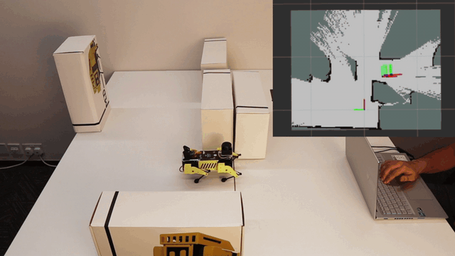

# SLAM & Autonomous Navigation

Real-time mapping and autonomous navigation for Mini Pupper using ROS 2 Nav2 stack with SLAM Toolbox and SmacPlanner2D.

## Overview

Mini Pupper supports two key navigation capabilities:
- **SLAM (Mapping)**: Create maps of your environment using the `mini_pupper_slam` package
- **Autonomous Navigation**: This package provides path planning and obstacle avoidance using maps created by SLAM

This navigation package depends on `mini_pupper_slam` to generate maps for real robot operation.

<p align="left">
  
</p>

## Architecture

This implementation integrates several ROS 2 navigation components:
- **SLAM Toolbox**: Real-time graph-based SLAM with loop closure detection
- **AMCL**: Adaptive Monte Carlo Localization for robot pose estimation
- **SmacPlanner2D**: Hybrid A* global path planner with obstacle-aware search
- **DWB Controller**: Dynamic Window Based local trajectory planning and execution
- **Nav2 Behavior Trees**: Coordinated navigation behaviors and recovery actions

## Requirements

- Mini Pupper 2 with lidar sensor and IMU enabled (check `mini_pupper_bringup/config/mini_pupper_2.yaml`)
- PC for running SLAM and navigation nodes
- Network connection between robot and PC

## Quick Start

### 1. SLAM (Mapping)

Create a map of your environment by driving the robot around while SLAM builds the map in real-time.

**Start the robot:**
```bash
# Terminal 1 (SSH to robot)
source ~/ros2_ws/install/setup.bash
ros2 launch mini_pupper_bringup bringup.launch.py
```

**Launch SLAM on PC:**
```bash
# Terminal 2 (PC)
source ~/ros2_ws/install/setup.bash
ros2 launch mini_pupper_slam slam_toolbox.launch.py
```

**Control the robot to build the map:**
```bash
# Terminal 3 (PC) - Keyboard control
source ~/ros2_ws/install/setup.bash
ros2 run teleop_twist_keyboard teleop_twist_keyboard
```

**Save the completed map:**
```bash
# Terminal 4 (PC)
source ~/ros2_ws/install/setup.bash
ros2 run nav2_map_server map_saver_cli -f ~/map
```

This creates two files: `map.pgm` and `map.yaml` in your home directory.

### 2. Navigation

Use your saved map for autonomous navigation with obstacle avoidance.

**Start the robot:**
```bash
# Terminal 1 (SSH to robot)
source ~/ros2_ws/install/setup.bash
ros2 launch mini_pupper_bringup bringup.launch.py
```

**Launch navigation with your map:**
```bash
# Terminal 2 (PC)
source ~/ros2_ws/install/setup.bash
ros2 launch mini_pupper_navigation navigation_smacplanner.launch.py map:=$HOME/map.yaml
```

**Set goals in RViz:**
1. Robot will automatically localize if started from the same position as SLAM mapping
2. Use "Nav2 Goal" to set navigation targets
3. Watch the robot autonomously navigate to the goal

## Tips for Best Results

**For SLAM:**
- Drive the robot slowly and smoothly
- Ensure good lidar visibility of walls and obstacles
- Cover the entire area you want to map
- Avoid rapid rotations that can confuse the mapping algorithm

**For Navigation:**
- Start the robot in the exact same location where mapping began
- Don't move furniture or obstacles between mapping and navigation
- Choose clear goal points away from obstacles

## Configuration

The system uses optimized parameters tuned for Mini Pupper's quadruped gait dynamics and lidar characteristics in desktop environments. Key optimizations include:
- AMCL motion model calibrated for walking gait oscillation
- DWB velocity sampling adapted for legged locomotion constraints  
- SmacPlanner2D cost parameters tuned for desk/table-scale environments

Configuration files:
- SLAM: `mini_pupper_slam/config/real_table.yaml`
- Navigation: `mini_pupper_navigation/param/real_table.yaml`

## Troubleshooting

**Robot not moving during navigation:**
- Verify the goal is reachable and not entirely blocked by obstacles

**Poor mapping quality:**
- Ensure lidar sensor is clean and unobstructed
- Check that the environment has sufficient features for SLAM

**Connection issues:**
- Verify ROS_DOMAIN_ID is the same on robot and PC
- Check network connectivity between devices