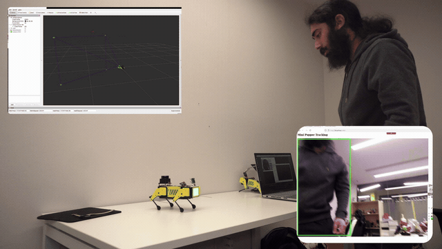
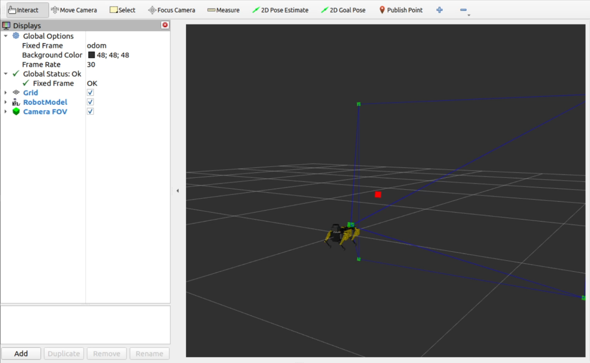

# Mini Pupper Tracking System

This ROS 2 package enables real-time person tracking for the Mini Pupper 2 robot.

It combines visual detection, multi-object tracking, and IMU-based motion control to guide the robot's head and orientation toward detected individuals.

## Features

- **YOLO11n object detection** on live camera feed  
- **Real-time tracking** with unique temporary IDs per person (via [motpy](https://github.com/wmuron/motpy))  
- **IMU-based PID control** for yaw correction and smooth pitch tracking  
- **Flask web interface** for monitoring camera and tracking overlays  
- **RViz visualisation** for 3D spatial awareness of detections and camera field of view

---

### Tracking Behaviour

<p align="left">
  
</p>

The robot uses YOLO11n to detect people and converts these detections into movement commands via PID control. Yaw adjustments are smoothed using IMU feedback to maintain heading stability.

---

### RViz Visualisation

<p align="left">
  
</p>

RViz displays:

- A pyramid cone representing the camera's field of view  
- Red points in 3D space representing detected individuals, estimated using bounding box area and field-of-view angles

---

### Web Interface (Flask)

The Flask web interface shows:

- The live camera feed  
- Detected individuals with bounding boxes  
- Assigned temporary UUIDs for short-term identification

This is useful for remote observation and debugging.

---

> **Note:** This package is only supported with the **Stanford Controller**. The **CHAMP Controller** is not supported.

### Hardware Requirements

- **Camera**: A Raspberry Pi Camera Module is required to run the tracking system.  
  This package was developed using the **v2 module**, compatibility with earlier camera versions such as **v1.3** has not been verified and may vary.

> **Note:** You will need to change the `camera` parameter in `mini_pupper_bringup/config/mini_pupper_2.yaml` to true

### Package Architecture

The tracking system consists of four main components:

- **Detection & Tracking** (`main.py` + `tracking_node.py`): YOLO11n-based person detection with multi-object tracking using motpy
- **Movement Control** (`movement_node.py`): PID-based robot control for yaw and pitch tracking with configurable parameters
- **Visualisation** (`camera_visualisation_node.py`): RViz camera FOV and 3d position markers for visualising the locations of people
- **Web Interface** (`flask_server.py`): Real-time video streaming with detection overlays

### Dependencies
Install the required Python packages and ROS2 components to use in the ROS2 workspace:

```bash
# Downgrade numpy to a compatible version
pip install "numpy<2.0"
```

```bash
# Python dependencies
pip install flask onnxruntime motpy
```

```bash
# ROS2 dependencies
sudo apt install ros-jazzy-imu-filter-madgwick ros-jazzy-tf-transformations
```

---

## 1. Export the YOLO11n ONNX Model

The required YOLO11n ONNX model (yolo11n.onnx) is already included in this repository at models/yolo11n.onnx with 320x320 input resolution.

Using a Different Model or Resolution **(Optional)**
If you want to use a different YOLO model or change the input resolution, follow these steps to export your own ONNX model:

### Step 1: Set up a virtual environment
```bash
python3 -m venv yolo-env
source yolo-env/bin/activate
```

### Step 2: Install Ultralytics
```bash
pip install ultralytics
```

### Step 3: Download and export the model
```bash
# Download the PyTorch model
wget https://github.com/ultralytics/assets/releases/download/v8.3.0/yolo11n.pt

# Export to ONNX with your desired input size
yolo export model=yolo11n.pt format=onnx imgsz=320  # Change 320 to your preferred resolution

# For other YOLO models, replace the URL:
# yolo11s.pt, yolo11m.pt, yolo11l.pt, yolo11x.pt

```

### Step 4: Move the ONNX model
Move the exported `.onnx` file to the tracking package directory:

```bash
mkdir ~/ros2_ws/src/mini_pupper_ros/mini_pupper_tracking/models/
mv yolo11n.onnx ~/ros2_ws/src/mini_pupper_ros/mini_pupper_tracking/models/
# To use the YOLO model you exported replace yolo11n.onnx with its model name

# To use a different YOLO model, also update the model name in tracking_node.py:
# e.g. MODEL_NAME = "yolo11m.onnx"
```

### Step 5: Update configuration (if needed)
If you changed the input resolution, update the parameter in `config/tracking_params.yaml`:

```bash
yolo:
  image_size: 320  # Change to match your exported model's input size
```

---

## 2. Quick Start

### Mini Pupper (on robot)
```bash
# Terminal 1 (SSH into robot)
source ~/ros2_ws/install/setup.bash  # Use setup.zsh if your shell is zsh
ros2 launch mini_pupper_bringup bringup_with_stanford_controller.launch.py
```

### Host PC
```bash
# Terminal 2
source ~/ros2_ws/install/setup.bash
ros2 launch mini_pupper_tracking tracking.launch.py
```

The web interface will automatically open at `http://localhost:5000` (configurable via parameters).

---

## 3. Visualisation

The package includes RViz visualisation showing:
- Camera field of view (FOV) as a square pyramid
- Detected person positions in 3D space with distance estimate from the camera using the detected area of the person
- Robot orientation and camera pose

Launch RViz separately to view:
```bash
# Terminal 3
source ~/ros2_ws/install/setup.bash
ros2 launch mini_pupper_description stanford_visualisation.launch.py
```

---

## 4. Configuration
The package provides configuration through YAML parameter files in the config/ directory:

**Key Configuration Files:**
`config/movement_params.yaml` - Robot movement control settings
`config/tracking_params.yaml` - YOLO detection and web interface settings

### Movement Control:

yaw.tracking_enabled: Enable/disable horizontal tracking (default: true)
pitch.tracking_enabled: Enable/disable vertical tracking (default: false)
yaw.Kp: PID proportional gain for turning responsiveness (default: 5.0)

### Detection Settings:

yolo.confidence_threshold: Detection confidence threshold (default: 0.7)
yolo.image_size: YOLO input resolution (default: 320)

### Web Interface:

flask.auto_open_browser: Auto-open browser on launch (default: true)
flask.frame_rate: Streaming frame rate (default: 15 FPS)

---

## 5. Testing

The package includes unit tests for the main testable functions of movement and visualisation:

```bash
# To run all tests
python3 -m pytest ~/ros2_ws/src/mini_pupper_ros/mini_pupper_tracking/test/ -v
```

---

## 7. Safety Notes

- Always test in a safe, open environment
- Keep emergency stop (Ctrl+C) readily available
- Start with tracking disabled and gradually enable features
- Monitor robot behaviour through web interface
- Ensure adequate lighting for camera detection

---

## 8. Technical Details

**Topics Published:**
- `/tracking_array`: Person detection results with tracking IDs
- `/robot_command`: Stanford Controller command messages
- `/camera_fov`: RViz visualisation markers

**Topics Subscribed:**
- `/image_raw`: Camera feed input
- `/imu/data_filtered_madgwick`: Filtered IMU orientation data

**Coordinate Systems:**
- Camera frame: +X forward, +Y left, +Z up
- Robot frame: Standard ROS conventions
- Detection coordinates: Normalised [0,1] image coordinates

> **Note:** Usage of this package with lidar activated, or with the Stanford controller twist_to_command_node launched may break its functionality due to topic conflicts.

---

## License

This package is licensed under the Apache-2.0 License. See individual source files for detailed copyright information.

---

## Compatibility

- **ROS 2**: Humble
- **Platform**: Ubuntu 24.04 LTS
- **Hardware**: Mini Pupper robots with Stanford Controller