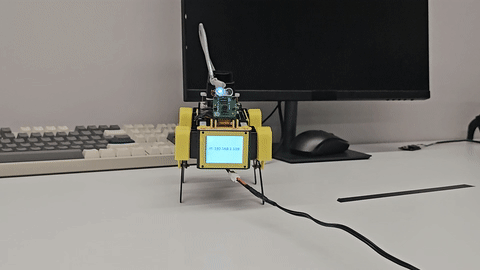

## Introduction

This tracking package was independently developed by the author during the 2025 Global Internship Programme at HKSTP.

It uses a YOLO11n model to detect people in the camera feed and convert detections into motion commands for the Mini Pupper robot.



> **Note:** This package is only supported with the **Stanford Controller**. The **CHAMP Controller** is not supported.

> ***IMPORTANT*** MAKE SURE YOU HAVE PLENTY OF SPACE ON YOUR TABLE IF THE ROBOT IS NOT ON THE FLOOR, MAKE SURE YOU ARE PREPARED FOR MOVEMENT!

> USE CTRL-C ON THE HOST PC TO STOP MOVEMENT

### Hardware Requirements

- **Camera**: A Raspberry Pi Camera Module is required to run the tracking system.  
  This package was developed using the **v2 module**, compatibility with earlier camera versions such as **v1.3** has not been verified and may vary.

### Dependencies
Install the required Python packages and ROS2 components to use in the ROS2 workspace:

```bash
# Python dependencies
pip install flask onnxruntime transforms3d
```

```bash
# ROS2 IMU filter package
sudo apt install ros-humble-imu-filter-madgwick
```

---

## 1. Export the YOLO11n ONNX Model

To use YOLO11n with the tracking module, export the pretrained model to ONNX format using Ultralytics. We recommend doing this in a virtual environment to avoid conflicts with other packages.

### Step 1: Set up a virtual environment
```bash
python3 -m venv yolo-env
source yolo-env/bin/activate
```

### Step 2: Install Ultralytics
```bash
pip install ultralytics
```

### Step 3: Download and export the model
```bash
wget https://github.com/ultralytics/assets/releases/download/v8.3.0/yolo11n.pt
yolo export model=yolo11n.pt format=onnx imgsz=320
```

### Step 4: Move the ONNX model
Move the exported `.onnx` file to the tracking package directory:

```bash
mkdir ~/ros2_ws/src/mini_pupper_ros/mini_pupper_tracking/models/
mv yolo11n.onnx ~/ros2_ws/src/mini_pupper_ros/mini_pupper_tracking/models/
```

---

## 2. Quick Start

### Mini Pupper (on robot)
```bash
# Terminal 1 (SSH into robot)
source ~/ros2_ws/install/setup.bash  # Use setup.zsh if your shell is zsh
ros2 launch mini_pupper_bringup bringup_with_stanford_controller.launch.py
```

### Host PC
```bash
# Terminal 2
source ~/ros2_ws/install/setup.bash
ros2 launch mini_pupper_tracking tracking.launch.py
```

## 3. Overview
This package includes the following Python scripts in the mini_pupper_tracking/mini_pupper_tracking folder:
- **flask_server.py**: Creates Flask web server for live video streaming and debugging interface
- **main.py**: Entry point that initializes the tracking node and Flask server
- **movement_node.py**: Subscribes to tracking data and IMU, computes PID control, publishes Command messages
- **tracking_node.py**: Processes camera feed, runs YOLO11n inference, publishes person detection results

> **Note:** Usage of this package with lidar activated, or with the Stanford controller twist_to_command_node launched may break its functionality.

