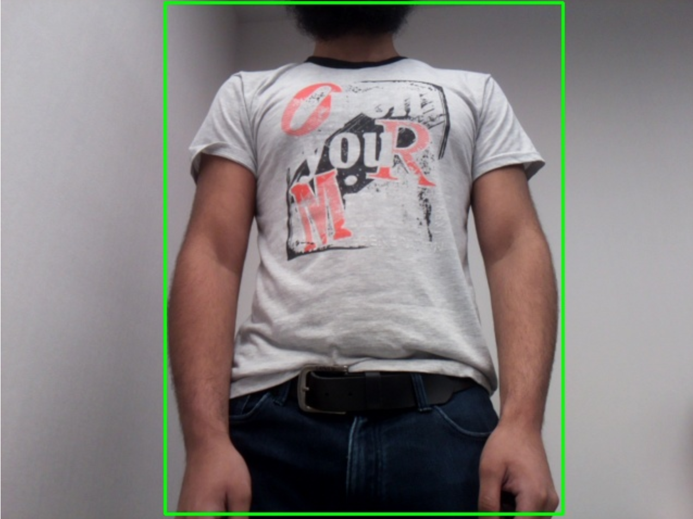

# Mini Pupper Tracking System

This ROS 2 package enables real-time person tracking for the Mini Pupper robot, developed independently during the 2025 Global Internship Programme at HKSTP.

It combines visual detection, multi-object tracking, and IMU-based motion control to guide the robot's head and orientation toward detected individuals.

## Features

- **YOLOv11n object detection** on live camera feed  
- **Real-time tracking** with unique temporary IDs per person (via [motpy](https://github.com/wmuron/motpy))  
- **IMU-based PID control** for yaw correction and smooth pitch tracking  
- **Flask web interface** for monitoring camera and tracking overlays  
- **RViz visualisation** for 3D spatial awareness of detections and camera field of view

---

## Demo

### Tracking Behaviour


The robot uses YOLOv11n to detect people and converts these detections into movement commands via PID control. Yaw adjustments are smoothed using IMU feedback to maintain heading stability.

---

### Web Interface (Flask)



The Flask web interface shows:

- The live camera feed  
- Detected individuals with bounding boxes  
- Assigned temporary UUIDs for short-term identification

This is useful for remote observation and debugging.

---

### RViz Visualisation


RViz displays:

- A pyramid cone representing the camera's field of view  
- Red points in 3D space representing detected individuals, estimated using bounding box area and field-of-view angles

---

> **Note:** This package is only supported with the **Stanford Controller**. The **CHAMP Controller** is not supported.

> ***IMPORTANT*** MAKE SURE YOU HAVE PLENTY OF SPACE ON YOUR TABLE IF THE ROBOT IS NOT ON THE FLOOR, MAKE SURE YOU ARE PREPARED FOR MOVEMENT!

> USE CTRL-C ON THE HOST PC TO STOP MOVEMENT

### Hardware Requirements

- **Camera**: A Raspberry Pi Camera Module is required to run the tracking system.  
  This package was developed using the **v2 module**, compatibility with earlier camera versions such as **v1.3** has not been verified and may vary.

> **Note:** You will need to change the `camera` parameter in `mini_pupper_bringup/config/mini_pupper_2.yaml` to true

### Package Architecture

The tracking system consists of four main components:

- **Detection & Tracking** (`main.py` + `tracking_node.py`): YOLO11n-based person detection with multi-object tracking using motpy
- **Movement Control** (`movement_node.py`): PID-based robot control for yaw and pitch tracking with configurable parameters
- **Visualisation** (`camera_visualisation_node.py`): RViz camera FOV and 3d position markers for visualising the locations of people
- **Web Interface** (`flask_server.py`): Real-time video streaming with detection overlays

### Dependencies
Install the required Python packages and ROS2 components to use in the ROS2 workspace:

```bash
# Python dependencies
pip install flask onnxruntime motpy
```

```bash
# ROS2 dependencies
sudo apt install ros-humble-imu-filter-madgwick ros-humble-tf-transformations
```

---

## 1. Export the YOLO11n ONNX Model

To use YOLO11n with the tracking module, export the pretrained model to ONNX format using Ultralytics. We recommend doing this in a virtual environment to avoid conflicts with other packages.

### Step 1: Set up a virtual environment
```bash
python3 -m venv yolo-env
source yolo-env/bin/activate
```

### Step 2: Install Ultralytics
```bash
pip install ultralytics
```

### Step 3: Download and export the model
```bash
wget https://github.com/ultralytics/assets/releases/download/v8.3.0/yolo11n.pt
yolo export model=yolo11n.pt format=onnx imgsz=320
```

### Step 4: Move the ONNX model
Move the exported `.onnx` file to the tracking package directory:

```bash
mkdir ~/ros2_ws/src/mini_pupper_ros/mini_pupper_tracking/models/
mv yolo11n.onnx ~/ros2_ws/src/mini_pupper_ros/mini_pupper_tracking/models/
```

---

## 2. Quick Start

### Mini Pupper (on robot)
```bash
# Terminal 1 (SSH into robot)
source ~/ros2_ws/install/setup.bash  # Use setup.zsh if your shell is zsh
ros2 launch mini_pupper_bringup bringup_with_stanford_controller.launch.py
```

### Host PC
```bash
# Terminal 2
source ~/ros2_ws/install/setup.bash
ros2 launch mini_pupper_tracking tracking.launch.py
```

The web interface will automatically open at `http://localhost:5000` (configurable via parameters).

---

## 3. Visualisation

The package includes RViz visualisation showing:
- Camera field of view (FOV) as a square pyramid
- Detected person positions in 3D space with distance estimate from the camera using the detected area of the person
- Robot orientation and camera pose

Launch RViz separately to view:
```bash
# Terminal 3
source ~/ros2_ws/install/setup.bash
ros2 launch mini_pupper_description stanford_visualisation.launch.py
```

---

## 4. Configuration

The package provides extensive configuration options through YAML parameter files:

### Movement Parameters (`config/movement_params.yaml`)

**Yaw Control (Horizontal Tracking):**
- `yaw.Kp`: Proportional gain for PID controller (default: 5.0)
- `yaw.Kd`: Derivative gain for damping (default: 0.1)
- `yaw.decay`: Angular velocity decay when target lost (default: 0.5)
- `yaw.clamp`: Maximum angular velocity limit (default: 2.0 rad/s)
- `yaw.stable_minimum`: Deadband threshold (default: 0.65 rad/s)
- `yaw.tracking_enabled`: Enable/disable yaw tracking (default: false)

**Pitch Control (Vertical Tracking):**
- `pitch.alpha`: Exponential smoothing factor (default: 0.1)
- `pitch.gain`: Pitch response multiplier (default: 1.0)
- `pitch.decay`: Offset decay when target lost (default: 0.5)
- `pitch.camera_deadband`: Vertical angle deadband (default: 0.020 rad)
- `pitch.tracking_enabled`: Enable/disable pitch tracking (default: false)

### Tracking Parameters (`config/tracking_params.yaml`)

**YOLO Detection:**
- `yolo.image_size`: Input image resize dimension (default: 320)
- `yolo.confidence_threshold`: Detection confidence threshold (default: 0.7)
- `yolo.iou_threshold`: Non-maximum suppression IoU threshold (default: 0.35)

**Flask Web Interface:**
- `flask.image_display_size`: Web display width in pixels (default: 1280)
- `flask.frame_rate`: Target streaming frame rate (default: 15 FPS)
- `flask.auto_open_browser`: Auto-open browser on launch (default: true)

### Enabling Tracking

**Important:** By default yaw tracking is enabled and pitch tracking is disabled, but both can be used together if desired, neither can be used, or exclusively pitch tracking may also be used

```yaml
# In movement_params.yaml
yaw:
  tracking_enabled: true  # Currently enabled
pitch:
  tracking_enabled: false  # Currently disabled
```

---

## 5. Testing

The package includes unit tests for the main testable functions of movement and visualisation:

```bash
# To run all tests
python3 -m pytest ~/ros2_ws/src/mini_pupper_ros/mini_pupper_tracking/test/ -v
```

---

## 7. Safety Notes

- Always test in a safe, open environment
- Keep emergency stop (Ctrl+C) readily available
- Start with tracking disabled and gradually enable features
- Monitor robot behaviour through web interface
- Ensure adequate lighting for camera detection

---

## 8. Technical Details

**Topics Published:**
- `/tracking_array`: Person detection results with tracking IDs
- `/robot_command`: Stanford Controller command messages
- `/camera_fov`: RViz visualisation markers

**Topics Subscribed:**
- `/image_raw`: Camera feed input
- `/imu/data_filtered_madgwick`: Filtered IMU orientation data

**Coordinate Systems:**
- Camera frame: +X forward, +Y left, +Z up
- Robot frame: Standard ROS conventions
- Detection coordinates: Normalised [0,1] image coordinates

> **Note:** Usage of this package with lidar activated, or with the Stanford controller twist_to_command_node launched may break its functionality due to topic conflicts.