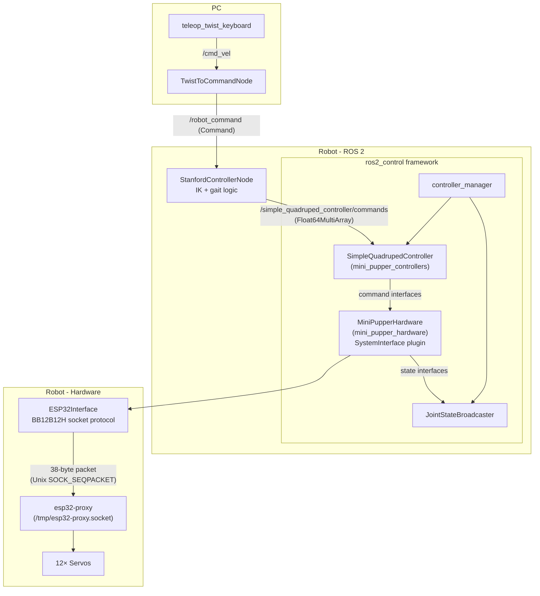

# Stanford Controller

This controller was originally developed by students from the Stanford Robotics Club. You can check out its source code [here](https://github.com/stanfordroboticsclub/StanfordQuadruped). It was later forked to [this repository](https://github.com/mangdangroboticsclub/StanfordQuadruped).

The `stanford_controller` package in this repository migrates the [StanfordQuadruped](https://github.com/mangdangroboticsclub/StanfordQuadruped) into the ROS2 ecosystem for the `mini_pupper_ros` project. Currently, the controller can only be run on a real device, not in a simulator.

## Architecture



**Key integration point**: `StanfordControllerNode` publishes joint position commands to `/simple_quadruped_controller/commands`. The `SimpleQuadrupedController` holds the robot in a neutral standing pose at startup (before any command arrives), then passes through commands from the stanford controller once they start flowing. The `MiniPupperHardware` plugin translates joint angles to servo positions and sends them to the hardware via the `esp32-proxy` socket.

## 1. Stanford Controller vs. Champ Controller

You can only run one controller at a time: either the Stanford Controller or the Champ Controller. 

- **Stanford Controller**: Simpler and more beginner-friendly for learning robotics.
- **Champ Controller**: More sophisticated and general, supporting multiple quadruped robot models.

To use the Champ Controller, refer to the main README document.

## 2. How to Run Mini Pupper with the Stanford Controller

### **Mini Pupper**
```sh
# Terminal 1 (SSH)
. ~/ros2_ws/install/setup.bash # Use setup.zsh if you use zsh instead of bash
ros2 launch mini_pupper_bringup bringup_with_stanford_controller.launch.py
```

### **PC**
```sh
# Terminal 2
source ~/ros2_ws/install/setup.bash
ros2 launch stanford_controller twist_to_command_converter.launch.py
```

```sh
# Terminal 3
source ~/ros2_ws/install/setup.bash
ros2 run teleop_twist_keyboard teleop_twist_keyboard
```

You can now control the robot using the keyboard in Terminal 3.

## 3. How to Make the Mini Pupper Dance

### **Mini Pupper**
```sh
# Terminal 1 (SSH)
. ~/ros2_ws/install/setup.bash # Use setup.zsh if you use zsh instead of bash
ros2 launch mini_pupper_bringup bringup_with_stanford_controller.launch.py
```

### **PC (or Mini Pupper)**
```sh
# Terminal 2 (SSH)
source ~/ros2_ws/install/setup.bash
ros2 launch mini_pupper_dance new_dance.launch.py
```

You can modify the `createDanceActionListSample.py` file in the `new_dance` folder to define new dance moves. Edit or add actions to the dance action list, where each action specifies a pose or movement for the robot. After making changes, rebuild the package to apply the updates.
